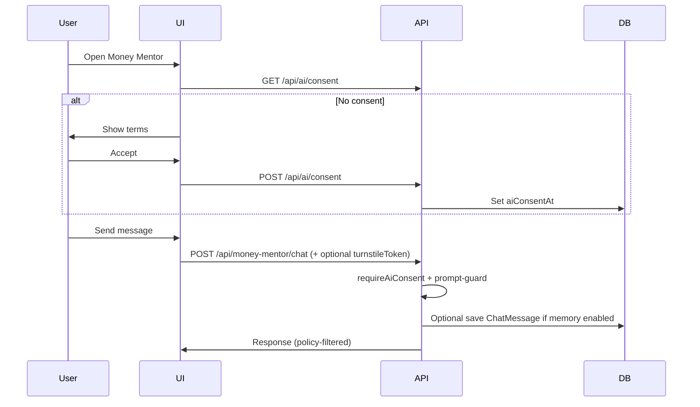

# StackZen AI Privacy Controls

**Owner:** Engineering / Product  
**Last updated:** 2026-05-16  
**Scope:** Money Mentor, AI recommendations, chat persistence, and related APIs.

This document describes user-facing privacy controls implemented in Phase 6 and how they map to code and data stores.

---

## Principles

1. **Explicit consent** — No AI features run until the user grants consent (`aiConsentAt`).
2. **Opt-out** — Users can disable all AI (`aiOptOut`).
3. **Memory is optional** — Chat history persistence requires consent **and** `aiMemoryEnabled`.
4. **Defense in depth** — Prompt guards, response policy, Turnstile (production), and audit logs.
5. **Deletion** — Users can clear stored AI memory; actions are audited.

---

## Data stored

| Data | Model / table | Tier | Encrypted at rest |
|------|---------------|------|-------------------|
| Consent timestamp | `UserSettings.aiConsentAt` | T2 | No (timestamp only) |
| Memory opt-in flag | `UserSettings.aiMemoryEnabled` | T1 | No |
| Global AI opt-out | `UserSettings.aiOptOut` | T1 | No |
| Chat messages | `ChatMessage` | T2–T3 | Optional (`ENCRYPT_CHAT_CONTENT`) |
| Interaction audit | `AiInteractionLog` | T1 | No (metadata; avoid prompt text in details) |

**Source of truth:** Prisma Postgres. Supabase is not used for AI consent storage.

---

## User controls

| Control | User action | API | Effect |
|---------|-------------|-----|--------|
| Grant consent | Accept AI terms in UI | `POST /api/ai/consent` | Sets `aiConsentAt`, clears `aiOptOut` |
| View status | Settings / pre-flight | `GET /api/ai/consent` | Returns privacy flags |
| Enable memory | Toggle in settings | `PATCH /api/settings` with `aiMemoryEnabled: true` | Allows `ChatMessage` writes |
| Opt out of AI | Disable AI in settings | Sets `aiOptOut: true` | All AI routes return `AI_OPT_OUT` |
| Clear memory | “Clear chat history” | `DELETE /api/ai/memory` or `POST /api/money-mentor/clear` | Deletes user’s `ChatMessage` rows |
| Disable memory only | Toggle off | `aiMemoryEnabled: false` | New chats not persisted; existing rows remain until clear |

---

## API enforcement

Every AI entrypoint calls `requireAiConsent(userId)` from `lib/ai/consent.ts`:

| Code | HTTP | When |
|------|------|------|
| `AI_CONSENT_REQUIRED` | 403 | `aiConsentAt` is null |
| `AI_OPT_OUT` | 403 | `aiOptOut` is true |

**Routes using consent (non-exhaustive):**

- `POST /api/money-mentor/chat`
- `GET /api/money-mentor/history`
- `POST /api/money-mentor/clear`
- `GET /api/ai-recommendations`
- Main `money-mentor` route (server handler)

**Memory write gate:** `canPersistAiMemory()` in `lib/ai/memory.ts` requires:

```text
aiConsentAt && aiMemoryEnabled && !aiOptOut
```

---

## Safety layers (non-privacy)

| Layer | Module | Behavior |
|-------|--------|----------|
| Prompt injection / length | `lib/ai/prompt-guard.ts` | Blocks suspicious input → `PROMPT_INJECTION` |
| Restricted topics | `lib/ai/prompt-guard.ts` | Blocks personalized investment directives → `RESTRICTED_TOPIC` |
| Response policy | `lib/ai/response-policy.ts` | Softens guarantees; adds professional disclaimer |
| Bot abuse | `lib/security/turnstile.ts` | Production chat may require Turnstile token → `TURNSTILE_FAILED` |

Audit actions (Prisma `AuditLog` + `AiInteractionLog`):

- `ai.consent_granted`
- `ai.memory_cleared`
- `ai.chat_completed`
- `ai.prompt_blocked`
- `ai.response_policy_applied`
- `ai.recommendations_viewed`

---

## Client integration flow



**Recommended UI order:**

1. Check consent → prompt if missing.
2. Do not call chat until `POST /api/ai/consent` succeeds.
3. Show memory toggle tied to settings `aiMemoryEnabled`.
4. Offer “Clear history” calling `DELETE /api/ai/memory`.

---

## Retention & deletion

| Scenario | Behavior |
|----------|----------|
| User clears memory | `ChatMessage` rows deleted for `userId`; audit `ai.memory_cleared` |
| User opts out | Existing messages **remain** until explicit clear (product may auto-clear in future) |
| Account deletion | Must cascade or job-delete `ChatMessage`, `AiInteractionLog`, `UserSettings` (verify account-deletion flow) |
| Admin access | No dedicated admin “read user chats” API in security program; treat as T2/T3 if added |

**Encryption:** When `ENCRYPT_CHAT_CONTENT=true`, content is AES-256-GCM via `lib/security/chat-content.ts`. Clearing memory deletes ciphertext rows.

---

## Logging & third-party LLMs

- **Application logs:** Use `logSafeError`; never log full prompts/responses in production.
- **Sentry:** Breadcrumbs and events pass through `redactValue`.
- **External LLM providers:** If `OPENAI_API_KEY` / `ANTHROPIC_API_KEY` / `GEMINI_*` are set, prompts leave the infrastructure subject to provider DPA. Document in privacy policy.

Server-only env vars (never `NEXT_PUBLIC_`):

- `OPENAI_API_KEY`, `ANTHROPIC_API_KEY`, `GOOGLE_GENERATIVE_AI_API_KEY`, `GEMINI_API_KEY`
- `ENABLE_AI_FEATURES` — master switch for server routes

---

## Environment variables

```env
ENABLE_AI_FEATURES="true"
ENCRYPT_CHAT_CONTENT="false"          # true = encrypt ChatMessage.content at rest
NEXT_PUBLIC_TURNSTILE_SITE_KEY=""   # production bot check on chat
TURNSTILE_SECRET_KEY=""
```

---

## Verification

```bash
npx jest lib/ai/__tests__/consent.test.ts lib/ai/__tests__/response-policy.test.ts lib/ai/__tests__/prompt-guard.test.ts
```

Manual:

1. New user → chat without consent → `403` `AI_CONSENT_REQUIRED`.
2. Grant consent → chat succeeds.
3. Opt out → `403` `AI_OPT_OUT`.
4. Clear memory → history empty; audit row present.

---

## Related documents

- [DATA_CLASSIFICATION.md](./DATA_CLASSIFICATION.md) — tiers for chat and PII
- [SECURITY_RELEASE_CHECKLIST.md](./SECURITY_RELEASE_CHECKLIST.md) — ship gate for AI
- [PHASE_6_IMPLEMENTATION_LOG.md](./PHASE_6_IMPLEMENTATION_LOG.md) — implementation detail
- [SECURITY_INCIDENT_RESPONSE.md](./SECURITY_INCIDENT_RESPONSE.md) — breach handling
