# StackZen Security Implementation Plan

**Date:** 2026-05-16  
**Prerequisite:** `docs/security/SECURITY_AUDIT_REPORT.md` (Phase 1 complete)  
**Principles:** Extend existing modules first; no duplicate utilities; no placeholder encryption or security theater; server-side enforcement; preserve MVP flows.

---

## Implementation strategy

```mermaid
flowchart LR
  subgraph phase1 [Phase 1 Done]
    A[SECURITY_AUDIT_REPORT.md]
    B[SECURITY_IMPLEMENTATION_PLAN.md]
  end
  subgraph phase2 [Phase 2 Foundation]
    C[proxy + headers]
    D[audit-log module]
    E[rate limits + Turnstile]
  end
  subgraph phase3 [Phase 3-6]
    F[Auth MFA sessions]
    G[DB encryption scope]
    H[Financial IDOR sweep]
  end
  subgraph phase4 [Phase 7-11]
    I[AI privacy]
    J[Tests + docs]
    K[Sentry redaction]
  end
  phase1 --> phase2 --> phase3 --> phase4
```



**ORM:** All schema work via **Prisma migrations** only.  
**Auth authority for APIs:** **NextAuth JWT** (`requireAuthSession`). Supabase session refresh stays in `proxy.ts` for SSR/cookie sync only.  
**Rate limiting:** Standardize on **`lib/api/rate-limit-request.ts`** + **`lib/auth/rate-limit.ts`** (Upstash). Deprecate `lib/rate-limit.ts` in-memory and ioredis limits in `middleware/security.ts`.

---

## Phase 2 — Security foundation

### 2.1 Global security headers

**Extend:** `next.config.js` `headers()` — do not add a second header pipeline.

| Task | Action |
|------|--------|
| CSP | Production-only strict CSP; development relaxed. Use env `CSP_ENABLED` / `NODE_ENV`. Allowlist Stripe, Plaid, Supabase, Sentry, Cloudflare Turnstile domains. Remove global `'unsafe-eval'` in production. |
| Permissions-Policy | Replace `interest-cohort=()` with camera/mic/geo/payment defaults `()` |
| HSTS | Keep; ensure only sent over HTTPS in production (Next/Vercel default) |
| Merge orphan CSP | Port useful directives from `middleware/security.ts` then **delete or gut** that file’s header function to avoid drift |

**CORS:** Wire `lib/cors.ts` into `proxy.ts` for `/api/*` OPTIONS and cross-origin API responses (allowlist only; no `*` with credentials).

**Files:** `next.config.js`, `proxy.ts`, `lib/cors.ts`, `lib/env.ts` (optional CSP report-uri env).

### 2.2 Middleware / proxy protection

**Extend:** `proxy.ts` (do not create `middleware.ts`).

| Route group | Matcher / logic |
|-------------|-----------------|
| `/dashboard/:path*`, `/(dashboard)/:path*` | Require JWT (existing) |
| `/admin/:path*` | JWT + role claim or server redirect to forbidden |
| `/mentor/:path*` | JWT + mentor capability check (or keep dashboard-only mentor UI) |
| `/api/financial/*` | N/A — use prefixes below |
| `/api/income/*`, `/api/expenses/*`, `/api/invoices/*`, `/api/quotes/*`, `/api/bank/*`, `/api/plaid/*`, `/api/transactions/*`, `/api/savings-*` | Optional edge rate limit by IP (light); **auth remains in handlers** |
| `/api/stripe/*` (except webhooks) | JWT at handler |
| `/api/webhooks/*`, `/api/plaid/webhook` | Skip JWT; enforce signature paths only |
| `/api/ai/*`, `/api/money-mentor`, `/api/ai-recommendations` | Rate limit at edge + handler |
| `/api/admin/*` | Handler `requireAdminSession` (keep); add edge rate limit |

**New helper:** `lib/security/proxy-policy.ts` — `isPublicPath`, `requiresAdminRole`, `isWebhookPath` (single source for proxy + tests).

**Safe redirects:** Validate `callbackUrl` / `next` query params against same-origin allowlist in auth pages.

**Suspicious requests:** Block obvious path traversal and scanner patterns in proxy (return 400/403, log breadcrumb).

**Wire unused limiters:** Use `RateLimiter` / `IPBlocker` in `proxy.ts` for **page** routes only, or remove dead imports.

**Delete or archive:** `middleware/security.ts` after merging useful parts.

### 2.3 Route security groups (handler layer)

Create **`lib/api/with-security.ts`** wrappers (composition, not duplication):

```ts
// Conceptual — implement with existing guards
withAuth(handler)
withAdmin(handler)
withZod(schema, handler)
withRateLimit(bucket, handler)
```

Apply systematically to route clusters in Phase 2 sprint order:

1. Financial CRUD (`income`, `expenses`, `invoices`, `quotes`, `clients`)
2. `stripe/connect/*` (already partial)
3. `plaid/*` + `bank/*`
4. AI routes
5. Remaining `NEEDS_REVIEW` from `docs/security-critical-audit.md`

### 2.4 Input validation

- **Rule:** Every `POST`/`PUT`/`PATCH`/`DELETE` with body uses Zod `.strict()`.
- **Shared schemas:** `lib/validation/` per domain (`income.ts`, `invoice.ts`, `auth.ts`, `ai.ts`).
- **Pattern:** `const body = schema.parse(await req.json())` inside try/catch → 400 generic message (no raw Zod tree to client in production).

### 2.5 Rate limiting

**Extend:** `enforceApiRateLimit` buckets in `lib/api/rate-limit-request.ts`:

| Bucket | Routes |
|--------|--------|
| `auth_login` | NextAuth credentials — custom authorize wrapper or `signIn` callback rate limit by email+IP |
| `auth_signup` | exists |
| `auth_password_reset_*` | exists |
| `ai_chat` | `money-mentor`, future zen routes |
| `financial_write` | POST/PATCH on income/expenses/invoices |
| `admin_api` | all `/api/admin/*` |
| `webhook_stripe` | optional IP-based soft limit |
| `webhook_plaid` | optional |

**Strict in production** for auth and financial write when Upstash missing (503).

**Remove:** `lib/rate-limit.ts` in-memory store after migration.

### 2.6 Bot protection (Cloudflare Turnstile)

**New:**

- `lib/security/turnstile.ts` — `verifyTurnstileToken(token, ip)` server-side
- `components/security/TurnstileWidget/index.tsx` — client widget

**Env:**

- `NEXT_PUBLIC_TURNSTILE_SITE_KEY`
- `TURNSTILE_SECRET_KEY`

**Integrate (server verify on submit):**

- `app/api/auth/signup/route.ts`
- NextAuth credentials sign-in path (or dedicated pre-sign-in API)
- `app/api/auth/request-reset/route.ts`
- `app/api/feedback/route.ts` (if public)
- `app/api/money-mentor/route.ts` (POST)
- Contact/public forms if present

**Do not** hardcode keys; fail closed in production if secret missing.

---

## Phase 3 — Auth hardening

### 3.1 MFA foundation

**Prisma migration** (additive only):

```prisma
// Add to User — names illustrative; match naming conventions
twoFactorSecret      String?   // encrypted at rest
mfaRequired          Boolean   @default(false)
webAuthnEnabled      Boolean   @default(false)
passkeyPreferred     Boolean   @default(false)
```

**New model `UserSession`** (or `AuthSession`):

```prisma
model UserSession {
  id              String   @id @default(cuid())
  userId          String
  ipHash          String
  userAgentHash   String
  deviceLabel     String?
  lastActiveAt    DateTime
  createdAt       DateTime @default(now())
  revokedAt       DateTime?
  revokedReason   String?
  user            User     @relation(...)
  @@index([userId])
  @@index([userId, revokedAt])
}
```

**Extend:** `lib/auth/security.ts` — remove `as any`; use `lib/security/encryption.ts` for `twoFactorSecret`.

**Admin MFA policy:** `requireAdminSession` checks `mfaRequired` + `twoFactorEnabled` (or passkey); return 403 with code `MFA_REQUIRED` — log challenge, do not block silently.

**Feature flag:** `ENABLE_WEBAUTHN` env + stub `lib/auth/webauthn.ts` using `@simplewebauthn/server` (deps already in lockfile).

### 3.2 Session security

**Unify:**

- NextAuth JWT for API
- `UserSession` table + Redis cache for device/session list (migrate logic from `SessionService` / admin `device:*` keys)

**Fields:** userId, ipHash (SHA-256 of IP + pepper), userAgentHash, deviceLabel, lastActiveAt, createdAt, revokedAt.

**Admin UI:** Continue `app/api/admin/devices/*` but read from Prisma `UserSession` as source of truth.

### 3.3 Suspicious login detection

**New:** `lib/security/login-risk.ts`

| Signal | Action |
|--------|--------|
| New device | Log + optional email; require 2FA step if enabled |
| Failed attempts | Upstash counter; lockout via existing `IPBlocker` |
| Impossible travel | Placeholder: store last login country from IP geo (optional MaxMind env); **log only**, no auto-block |
| Admin from new device | `logAdminAudit` + security event severity `warning` |

**Extend:** `lib/auth/security-monitor.ts` if present — call centralized audit, not Supabase client from server.

---

## Phase 4 — Database security (Prisma)

### 4.1 Row-level ownership

- **Rule:** All `findUnique` / `update` / `delete` on user resources use `where: { id, userId: session.user.id }` or `findFirst`.
- **Helper:** `lib/db/owned.ts` — `assertOwnedResource(prisma.model, id, userId)`.
- **Sweep:** Script or CI grep for `findUnique({ where: { id:` without `userId` in financial routes.

### 4.2 Field-level encryption

**Extend:** `lib/security/encryption.ts`

- Require `BANK_TOKEN_ENCRYPTION_KEY` (32-byte base64 or hex) in production — **no** fallback to `NEXTAUTH_SECRET` in prod.
- Add `encryptJson` / `decryptJson` for structured fields.

**Migrate usage:**

| Field / model | Action |
|---------------|--------|
| `BankConnection.accessTokenEncrypted` | Already encrypted — verify key handling |
| `ChatMessage.content` (AI memory) | Optional encrypted column or `contentEncrypted` migration |
| Mentor private notes | If stored in DB, encrypt on write |
| Tax / behavior summary JSON | Encrypt in `UserOnboardingData` or dedicated table |

**Do not use** `crypto-js` (per product security plan deprecation).

### 4.3 Secrets handling

- Audit `NEXT_PUBLIC_*` — no secrets.
- Move any leaked server keys out of client bundles.
- Document in `DATA_CLASSIFICATION.md` (Phase 11).

### 4.4 Migrations

- One migration per feature: MFA columns, `UserSession`, AI consent columns, encrypted columns (nullable → backfill job).
- Never edit applied migration SQL.

---

## Phase 5 — Financial data protection

| Domain | Tasks |
|--------|-------|
| Income / expenses | Ownership helper on all routes; Zod strict; audit on create/update/delete |
| Bank / Plaid | Never return `accessTokenEncrypted` to client; mask `accessTokenLast4` only |
| Invoices / quotes | PDF download route → Prisma + `requireAuthSession` (fix Drizzle straggler) |
| Stripe | Webhook-only status transitions; `verify-payment` documented as non-authoritative |
| Logging | `lib/security/redact.ts` — strip card numbers, tokens, full Plaid payloads before `console` / Sentry |

**Audit events:** income/expense/invoice lifecycle → `lib/security/audit-log.ts`.

---

## Phase 6 — AI safety and privacy

### 6.1 Schema (Prisma)

Add to `User` or `UserSettings`:

```prisma
aiConsentAt          DateTime?
aiMemoryEnabled      Boolean   @default(false)
aiOptOut             Boolean   @default(false)
```

Optional `AiInteractionLog` model (immutable append-only) instead of overloading `ChatMessage` for audit.

### 6.2 Enforcement

**New modules:**

| File | Purpose |
|------|---------|
| `lib/ai/consent.ts` | `requireAiConsent(session)` |
| `lib/ai/prompt-guard.ts` | Injection patterns, length limits, system prompt hardening |
| `lib/ai/response-policy.ts` | Block directive phrases; suggest compliant alternatives |
| `lib/ai/memory.ts` | CRUD memory with opt-out; deletion API |

**Extend:** `app/api/money-mentor/route.ts` — consent check, prompt guard, response policy, rate limit, Turnstile.

**Remove dev auth bypass** on `ai-recommendations` in production.

### 6.3 Language policy

Implement `response-policy.ts` rules from product brief:

- Block: “You should invest in…”, “You need to…”, “guaranteed”, “Take this loan”, “Buy this stock”
- Prefer: “One option to consider…”, “You may want to compare…”, “review with a professional”, “Would you like to explore…”

---

## Phase 7 — Audit logging

**Create:** `lib/security/audit-log.ts`

```ts
export type AuditEvent = { action: string; userId?: string; resource?: string; severity?: ...; details?: ...; ip?: string }
export async function writeAuditLog(event: AuditEvent): Promise<void>
```

- **Single writer** → Prisma `AuditLog` only.
- **Deprecate** server use of `lib/auth/security-audit.ts` Supabase inserts; keep read path migration plan for existing Supabase data if any.

**Extend:** `app/api/admin/audit-logs/route.ts` — no changes to contract if possible.

**Immutable:** No UPDATE/DELETE APIs for audit logs; admin UI read-only.

**Event catalog:** login, failed_login, password_reset, mfa_*, profile_*, income_*, expense_*, invoice_*, stripe_webhook_*, plaid_*, ai_memory_*, mentor_access_*, admin_*, suspicious_*.

---

## Phase 8 — Monitoring and incident response

### 8.1 Sentry

**Extend:** `sentry.server.config.ts` — `beforeSend` redaction using `lib/security/redact.ts`.

**Breadcrumbs:** security events in `writeAuditLog` failure paths, rate limit 429s (sampled).

**Performance:** trace sensitive routes (`/api/bank/*`, `/api/invoices/*`, admin).

### 8.2 Startup validation

**Create:** `instrumentation.ts` at project root:

```ts
export async function register() {
  const { assertCoreServerEnv } = await import('@/lib/env');
  assertCoreServerEnv();
}
```

### 8.3 Documentation (Phase 11 overlap)

**Create:** `docs/security/SECURITY_INCIDENT_RESPONSE.md` — detection, containment, notification, patch, postmortem, evidence, credential rotation checklist.

---

## Phase 9 — Admin security

| Requirement | Implementation |
|-------------|----------------|
| MFA required | `requireAdminSession` + `mfaRequired` for ADMIN/SUPER_ADMIN |
| Role required | Existing |
| Audit every admin action | `writeAuditLog` in all admin mutating routes |
| Hide sensitive data | Default API selects exclude PII; `?includeSensitive=true` logs `ADMIN_VIEW_SENSITIVE` |
| Session timeout | Shorter NextAuth `maxAge` for admin role or idle timeout in `UserSession` |
| No client-only checks | Fix `RoleGuard` to use `ADMIN` enum; add server layout guard `app/admin/layout.tsx` |

---

## Phase 10 — Testing

**Framework:** Jest (existing `npm test`).

**New test files:**

| File | Cases |
|------|-------|
| `lib/security/__tests__/encryption.test.ts` | round-trip; rejects invalid payload; prod key required |
| `lib/security/__tests__/redact.test.ts` | masks tokens/cards |
| `lib/api/__tests__/require-auth.test.ts` | 401 without session |
| `__tests__/api/security/idor-invoice.test.ts` | user A cannot read user B invoice |
| `__tests__/api/security/admin-forbidden.test.ts` | USER role → 403 on `/api/admin/users` |
| `__tests__/api/security/rate-limit.test.ts` | mock Upstash; 429 after threshold |
| `lib/ai/__tests__/response-policy.test.ts` | blocks directive phrases |
| `lib/ai/__tests__/consent.test.ts` | opt-out blocks memory write |

**CI:** `npm run test:security` — see `.github/workflows/security-tests.yml`.

---

## Phase 11 — Documentation deliverables

| Document | Status |
|----------|--------|
| `SECURITY_AUDIT_REPORT.md` | ✅ Phase 1 |
| `SECURITY_IMPLEMENTATION_PLAN.md` | ✅ This file |
| `SECURITY_INCIDENT_RESPONSE.md` | ✅ Phase 8 |
| `PHASE_8_IMPLEMENTATION_LOG.md` | ✅ Phase 8 |
| `PHASE_9_IMPLEMENTATION_LOG.md` | ✅ Phase 9 |
| `PHASE_10_IMPLEMENTATION_LOG.md` | ✅ Phase 10 |
| `DATA_CLASSIFICATION.md` | ✅ Phase 11 |
| `SECURITY_RELEASE_CHECKLIST.md` | ✅ Phase 11 |
| `AI_PRIVACY_CONTROLS.md` | ✅ Phase 11 |
| `PHASE_11_IMPLEMENTATION_LOG.md` | ✅ Phase 11 |
| `SECURITY_DELIVERY_CHECKLIST.md` | ✅ Phase 12 |
| `PHASE_12_IMPLEMENTATION_LOG.md` | ✅ Phase 12 |

---

## Phase 12 — Final program delivery

**Goal:** Sign off the security program (Phases 1–11) with verified controls, automated checks, and documented backlog.

| Deliverable | Path |
|-------------|------|
| Final delivery checklist | `docs/security/SECURITY_DELIVERY_CHECKLIST.md` |
| Implementation log | `docs/security/PHASE_12_IMPLEMENTATION_LOG.md` |
| Verifier script | `scripts/verify-security-program.mjs` |

```bash
npm run verify:security   # files, docs, check-public-env, check-financial-owned-queries
npm run test:security
```

**Sign-off:** Engineering + security reviewer complete the sign-off table in `SECURITY_DELIVERY_CHECKLIST.md`.

**Post-program backlog** (not blocking delivery): password-reset Turnstile, full API Zod sweep, WebAuthn ceremonies, optional Supabase audit backfill — see delivery checklist.

---

## File change map (planned)

### Create

- `lib/security/audit-log.ts`
- `lib/security/redact.ts`
- `lib/security/turnstile.ts`
- `lib/security/proxy-policy.ts`
- `lib/security/login-risk.ts`
- `lib/api/with-security.ts`
- `lib/validation/*` (domain schemas)
- `lib/ai/consent.ts`, `prompt-guard.ts`, `response-policy.ts`, `memory.ts`
- `lib/auth/webauthn.ts` (behind flag)
- `instrumentation.ts`
- `components/security/TurnstileWidget/index.tsx`
- `app/admin/layout.tsx` (server guard)
- Test files listed in Phase 10
- Phase 11 docs (4 files)

### Modify (high touch)

- `proxy.ts`
- `next.config.js`
- `lib/env.ts`, `.env.example`
- `lib/security/encryption.ts`
- `lib/api/require-admin.ts`, `require-auth.ts`, `rate-limit-request.ts`
- `lib/auth-config.ts`, `lib/auth/security.ts`, `lib/auth/session.ts`
- `prisma/schema.prisma` + new migrations
- Financial + AI API routes (batch)
- `sentry.server.config.ts`
- `components/auth/RoleGuard.tsx`

### Remove / deprecate

- `middleware/security.ts` (after merge)
- `lib/rate-limit.ts` (after migration)
- Server-side use of `lib/auth/security-audit.ts` Supabase writer (deprecate)

---

## Environment variables (to add)

| Variable | Purpose |
|----------|---------|
| `BANK_TOKEN_ENCRYPTION_KEY` | Required in prod for AES-GCM |
| `ENCRYPTION_KEY_PEPPER` | Optional IP/UA hashing |
| `NEXT_PUBLIC_TURNSTILE_SITE_KEY` | Turnstile widget |
| `TURNSTILE_SECRET_KEY` | Server verification |
| `ENABLE_WEBAUTHN` | Passkeys feature flag |
| `CSP_REPORT_URI` | Optional CSP reports |
| `SECURITY_STRICT_RATE_LIMIT` | Force 503 without Upstash |

Update `.env.example` and `lib/env.ts` Zod schema.

---

## Migration commands

```bash
npm run prisma:generate
npx prisma migrate dev --name security_mfa_sessions
npx prisma migrate dev --name security_ai_consent
# Apply in CI/production:
npx prisma migrate deploy
```

---

## Test commands

```bash
npm test
npm test -- --testPathPattern=security
npm run typecheck:ci
```

---

## Rollout order (recommended sprints)

| Sprint | Focus | Exit criteria |
|--------|-------|---------------|
| S1 | Proxy policy, headers, CORS, Turnstile on signup/login, `instrumentation.ts` | APIs documented; auth bots mitigated |
| S2 | `audit-log.ts`, redact, Sentry beforeSend, admin MFA gate | Admin actions logged; no token leaks in Sentry |
| S3 | Prisma MFA/session migration, encryption key enforcement | 2FA persists without `as any` |
| S4 | Financial IDOR + Zod sweep (top 30 routes) | Grep clean for userId body trust |
| S5 | AI consent, prompt/response policy, memory deletion | money-mentor compliant |
| S6 | Security test pack + release checklist | CI green on security tests |

---

## Risks and assumptions

- **Assumption:** Team accepts NextAuth as sole API auth authority; Supabase remains for optional features/RLS on direct client queries only.
- **Risk:** Tightening CSP may break inline scripts until nonces implemented — stage in preview.
- **Risk:** 212 API routes — full Zod/ownership sweep is multi-sprint; prioritize financial and admin first.
- **Risk:** Migrating off Supabase `security_audit_log` requires data migration if production data exists there.
- **No breaking change:** Public marketing pages and Stripe/Plaid webhook contracts preserved; additive schema only.

---

## Definition of done (program level)

- [x] `proxy.ts` enforces documented route policies; no orphaned security middleware
- [x] Single audit writer; financial/AI/admin events covered
- [x] Turnstile on auth + sensitive AI/forms in production (password-reset Turnstile: backlog)
- [x] `BANK_TOKEN_ENCRYPTION_KEY` required in production
- [x] Admin requires MFA; server-side layout guard
- [x] Security Jest pack passes in CI
- [x] Phase 11 docs published
- [x] Final delivery checklist (Phase 12) — `SECURITY_DELIVERY_CHECKLIST.md`

---

## Document control

| Version | Date | Notes |
|---------|------|-------|
| 1.0 | 2026-05-16 | Initial plan from Phase 1 audit |

**Do not start Phase 2 coding until stakeholders acknowledge P0 items in the audit report.**
