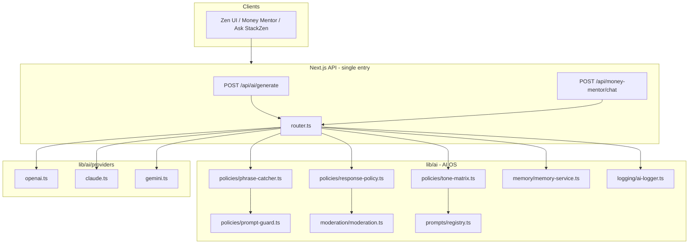

# StackZen AI Orchestration Plan

**Version:** 1.0  
**Date:** 2026-05-16  
**Prerequisite:** [`AI_SYSTEM_AUDIT.md`](./AI_SYSTEM_AUDIT.md) (Phase 1 — complete)  
**Objective:** Production-grade multi-model AI operating system for StackZen — not a chatbot.

---

## 1. Design principles

| Principle | Implementation requirement |
|-----------|---------------------------|
| **Non-directive guidance** | All providers receive compliance system prompts; output passes `response-policy` |
| **No guarantees** | Block/replace guarantee language; log `ai.response_policy_applied` |
| **No buy/sell/invest directives** | Input + output policies; PhraseCatcher affordability intents |
| **Emotional safety** | Claude-primary for empathetic modes; crisis phrase escalation path |
| **User-controlled memory** | Consent + opt-out + clear; memory write behind `canPersistAiMemory` |
| **Auditability** | Every orchestrated call → `AiInteractionLog` + optional `AuditLog` |
| **Low hallucination** | Tool-grounded financial figures; cite data source in metadata |
| **Multi-provider + fallback** | Router tries primary → secondary → tertiary with circuit breaker |
| **No placeholders** | Real HTTP/SDK adapters; no mock routing in production code |
| **No duplication** | Single router; deprecate direct `callFinGPT` from components |

---

## 2. Target architecture



**Rule:** No component imports `@/lib/ai/providers/*` directly. All traffic: **API → router → provider**.

---

## 3. Core types (shared contract)

```typescript
// lib/ai/types.ts

export type AIProviderId = 'openai' | 'claude' | 'gemini';

export type AITaskType =
  | 'orchestration'      // routing, structured plans, tool selection
  | 'financial_guidance' // educational coaching copy
  | 'emotional_support'  // empathetic, non-clinical support
  | 'document_analysis'  // uploads, statements, long PDFs
  | 'summarization'      // reports, dashboards
  | 'structured_output'; // JSON schemas, workflows

export interface AIMessage {
  role: 'system' | 'user' | 'assistant';
  content: string;
}

export interface AIRequest {
  task: AITaskType;
  messages: AIMessage[];
  userId: string;
  sessionId?: string;
  tone?: 'calm' | 'coach' | 'direct';
  intent?: string; // from PhraseCatcher
  context?: {
    incomeProfileTags?: string[];
    financialSnapshot?: Record<string, unknown>; // tool-grounded only
    documentRefs?: string[];
  };
  options?: {
    maxTokens?: number;
    temperature?: number;
    jsonSchema?: Record<string, unknown>;
    preferredProvider?: AIProviderId;
    allowFallback?: boolean;
  };
}

export interface AIResponse {
  text: string;
  provider: AIProviderId;
  model: string;
  policyApplied: boolean;
  blocked: boolean;
  blockCode?: string;
  usage?: { inputTokens?: number; outputTokens?: number };
  latencyMs: number;
  fallbackUsed: boolean;
  metadata?: Record<string, unknown>;
}

export interface AIProvider {
  readonly id: AIProviderId;
  isConfigured(): boolean;
  generate(input: AIRequest): Promise<AIResponse>;
}
```

---

## 4. Model routing strategy

### 4.1 Primary assignment (per product requirements)

| Provider | Models (configurable via env) | Primary tasks | Rationale |
|----------|------------------------------|---------------|-----------|
| **OpenAI** | `gpt-5` / `gpt-5.5` (env: `OPENAI_MODEL`) | `orchestration`, `structured_output`, `summarization`, tool logic | Strong structured outputs & agentic workflows |
| **Claude** | `claude-sonnet-4-*` (env: `ANTHROPIC_MODEL`) | `financial_guidance`, `emotional_support` | Safer long-form, coaching tone |
| **Gemini** | `gemini-2.5-pro` (env: `GEMINI_MODEL`) | `document_analysis`, backup `orchestration` | Long context window |

### 4.2 Router decision table

| Task | Primary | Fallback 1 | Fallback 2 |
|------|---------|------------|------------|
| `orchestration` | openai | gemini | claude |
| `structured_output` | openai | gemini | — |
| `financial_guidance` | claude | openai | gemini |
| `emotional_support` | claude | openai | — |
| `document_analysis` | gemini | openai | claude |
| `summarization` | openai | gemini | claude |

### 4.3 Router algorithm (`lib/ai/router.ts`)

1. **Consent** — `requireAiConsent(userId)` (existing).
2. **Feature flag** — `ENABLE_AI_FEATURES !== 'false'`.
3. **PhraseCatcher** — classify intent; block or reroute restricted intents.
4. **Prompt guard** — `guardUserPrompt` on last user message.
5. **Tone matrix** — merge tone modifier into system prompt.
6. **Prompt registry** — assemble system + compliance + task prompts.
7. **Provider selection** — table above + user `preferredProvider` if allowed.
8. **Generate** — call adapter with timeout (e.g. 30s) and 1 retry on 429/5xx.
9. **Fallback** — on failure, next provider in chain if `allowFallback !== false`.
10. **Response policy** — `softenDirectivePhrases` → `applyResponsePolicy`.
11. **Moderation** — optional secondary scan (provider moderation API).
12. **Memory** — persist if `canPersistAiMemory`; never persist blocked content.
13. **Log** — `logAiInteraction` with provider, model, latency, policy flags (no raw PII in prod).

### 4.4 Circuit breaker

- Per-provider failure counter in memory (dev) / Redis (prod).
- Open circuit after 5 failures in 60s; half-open after 120s.
- Emit `ai.provider_circuit_open` audit event.

---

## 5. Directory structure (Phase 2+)

```
lib/ai/
  types.ts                 # Shared contracts
  router.ts                # Orchestration entry
  config.ts                # Env validation, model names, timeouts

  providers/
    index.ts               # Registry + factory
    openai.ts              # AIProvider implementation
    claude.ts
    gemini.ts
    errors.ts              # Typed provider errors

  prompts/
    registry.ts            # Versioned prompt templates
    compliance.ts          # Non-directive system rules (single source of truth)
    money-mentor.ts        # Moves MONEY_MENTOR_SYSTEM_PREAMBLE here
    tone-modifiers.ts      # Calm / Coach / Direct appendices

  policies/
    phrase-catcher.ts      # Intent detection (deterministic)
    tone-matrix.ts         # User tone → prompt modifier
    prompt-guard.ts        # MOVE from lib/ai/prompt-guard.ts
    response-policy.ts     # MOVE from lib/ai/response-policy.ts
    intent-policy.ts       # Affordability / crisis / restricted intents

  memory/
    memory-service.ts      # Facade over chat-persistence + future graph
    conversation.ts        # Thread model (Phase 3)

  logging/
    ai-logger.ts           # Unified logAiInteraction + metrics fields

  moderation/
    moderation.ts          # Optional OpenAI moderation / custom rules

  __tests__/
    router.test.ts
    phrase-catcher.test.ts
    providers/*.test.ts
```

**Migration:** Move existing `prompt-guard.ts` / `response-policy.ts` into `policies/` with re-exports from old paths during transition (one release), then remove re-exports.

---

## 6. Provider adapter requirements

Each of `openai.ts`, `claude.ts`, `gemini.ts` must:

1. Implement `AIProvider` interface exactly.
2. Use **server-only** env keys (never `NEXT_PUBLIC_`).
3. Inject `compliance.ts` system prompt + task-specific prompt from registry.
4. Map `AIRequest.options.jsonSchema` to provider-native structured output.
5. Return normalized `AIResponse` with token usage when available.
6. Throw typed errors (`ProviderTimeout`, `ProviderRateLimit`, `ProviderNotConfigured`).
7. **Never** call other providers (router owns fallback).

### 6.1 Environment variables (add to `lib/env.ts` Zod schema)

```bash
# Feature gate
ENABLE_AI_FEATURES=true

# OpenAI
OPENAI_API_KEY=
OPENAI_MODEL=gpt-5

# Anthropic
ANTHROPIC_API_KEY=
ANTHROPIC_MODEL=claude-sonnet-4-20250514

# Google Gemini
GOOGLE_GENERATIVE_AI_API_KEY=
GEMINI_MODEL=gemini-2.5-pro

# Orchestration tuning
AI_REQUEST_TIMEOUT_MS=30000
AI_MAX_FALLBACK_DEPTH=2

# Deprecate after migration
FINGPT_API_URL=
FINGPT_API_KEY=
```

---

## 7. PhraseCatcher (implement for real)

**Location:** `lib/ai/policies/phrase-catcher.ts`

Deterministic intent detection (regex + keyword scoring, **not** LLM):

| Intent | Example triggers | Router action |
|--------|------------------|---------------|
| `help_general` | "I need help", "I'm struggling" | `emotional_support` or `financial_guidance` |
| `affordability` | "Can I afford", "should I buy" | Block or reframed educational response |
| `investing_education` | "how does investing work" | `financial_guidance` + extra policy |
| `crisis_distress` | self-harm adjacent phrases | Static safe response + resources; **no LLM** |
| `restricted_advice` | buy/sell/guaranteed | Delegate to `prompt-guard` |

Output:

```typescript
export interface PhraseCatcherResult {
  intent: string;
  confidence: number;
  block?: { code: string; message: string };
  suggestedTask?: AITaskType;
}
```

Integrate with existing `RESTRICTED_TOPIC_PATTERNS` — no duplicate regex lists (import shared patterns).

---

## 8. Tone Matrix (implement for real)

**Location:** `lib/ai/policies/tone-matrix.ts`

| Tone | Prompt modifier | Default provider bias |
|------|-----------------|----------------------|
| `calm` | Short sentences, validate feelings, no urgency | claude |
| `coach` | Motivational questions, action-oriented framing | claude |
| `direct` | Bullet points, concise facts, still non-directive | openai |

**Sources:** `UserSettings` or `UserOnboardingData.aiCommunicationStyle` (normalize enum).

---

## 9. Compliance prompt (single source of truth)

**Location:** `lib/ai/prompts/compliance.ts`

Consolidate:

- Current `MONEY_MENTOR_SYSTEM_PREAMBLE`
- Product rules: no direct advice, no guarantees, no buy/sell/invest
- Emotional safety boundaries (not clinical therapy)
- Suggest licensed professionals / human mentors when appropriate

All providers prepend this block **before** task-specific prompts.

---

## 10. API surface changes

### 10.1 New unified endpoint

```
POST /api/ai/generate
Body: { task, message, sessionId?, tone?, context?, turnstileToken? }
Response: AIResponse DTO (sanitized)
```

### 10.2 Refactor existing

| Current | Target |
|---------|--------|
| `handleMoneyMentorChat` rule-only | Call `router.generate({ task: 'financial_guidance', ... })` |
| Client `callFinGPT` | **Remove** — use `/api/ai/generate` |
| Duplicate money-mentor routes | Single POST/GET/clear |
| Static `ai-recommendations` | Either real orchestrated insights or rename to `educational-cards` |

### 10.3 Consent UX (Phase 2b)

- Block chat UI until `GET /api/ai/consent` shows `aiConsentAt`.
- `useMoneyMentor` → call consent on mount.
- `AiPersonalizationControls` → memory + opt-out toggles.

---

## 11. Memory evolution

### Phase 2 (minimal)

- Keep `ChatMessage` with added columns (migration):

```prisma
model ChatMessage {
  // existing...
  role           String?   // 'user' | 'assistant'
  conversationId String?
  provider       String?
  model          String?
}
```

- Stop using `index % 2` for role inference.

### Phase 3 (Memory Graph)

- `AiMemoryNode` table: typed facts (user-approved), source, expiresAt.
- User can view/delete nodes in settings.
- Router injects only **approved** nodes into context (max N tokens).

---

## 12. Logging & observability

**Extend `logAiInteraction` details schema:**

```typescript
{
  task: AITaskType;
  provider: AIProviderId;
  model: string;
  latencyMs: number;
  fallbackUsed: boolean;
  policyApplied: boolean;
  promptBlocked?: boolean;
  intent?: string;
  tone?: string;
  // Never: full prompt/response in production
}
```

**Add:**

- `GET /api/admin/ai/logs` (admin only, paginated, redacted)
- Sentry breadcrumbs on provider failures (existing `lib/security/sentry.ts` pattern)

---

## 13. Moderation layer

**Location:** `lib/ai/moderation/moderation.ts`

1. Pre-generation: existing `guardUserPrompt`.
2. Post-generation: existing `applyResponsePolicy`.
3. Optional: OpenAI Moderation API on user input + assistant output.
4. Crisis intents: bypass LLM entirely (PhraseCatcher).

---

## 14. Document analysis (Gemini path)

1. Upload → Supabase Storage (existing patterns).
2. Server extracts text (pdf-parse or Gemini native file API).
3. Router task `document_analysis` → Gemini 2.5 Pro.
4. Response includes `metadata.sources` (page/section references).
5. Policy pass + disclaimer footer appended in router.

---

## 15. FinGPT deprecation plan

| Step | Action |
|------|--------|
| 1 | Implement router + at least OpenAI + Claude adapters |
| 2 | Add server route wrapping former FinGPT behavior for backward compat |
| 3 | Update `ask-stackzen`, `planning-coach`, `goal-advisor-ai` to `/api/ai/generate` |
| 4 | Delete `lib/ai/fingpt.ts` |
| 5 | Remove `FINGPT_*` env vars from docs |

---

## 16. Implementation phases

### Phase 2a — Core (required before UI promises)

- [ ] `lib/ai/types.ts`, `config.ts`
- [ ] `lib/ai/providers/{openai,claude,gemini}.ts` + `index.ts`
- [ ] `lib/ai/router.ts`
- [ ] `lib/ai/prompts/compliance.ts` + `registry.ts`
- [ ] Move policies; expand regex coverage + tests
- [ ] `lib/ai/logging/ai-logger.ts`
- [ ] `POST /api/ai/generate`
- [ ] Refactor `money-mentor-service.ts` to use router
- [ ] Env validation in `lib/env.ts`

### Phase 2b — Product integration

- [ ] PhraseCatcher + Tone Matrix
- [ ] Consent UI wiring
- [ ] Remove client-side FinGPT
- [ ] Consolidate duplicate API routes
- [ ] `ENABLE_AI_FEATURES` gating

### Phase 3 — Advanced

- [ ] Conversation model + memory graph
- [ ] RAG / embeddings (Supabase pgvector) for doc search
- [ ] Tool-calling: Plaid balances, invoice totals (grounded numbers)
- [ ] Admin AI audit dashboard
- [ ] Restore `docs/stackzen-ai-compliance-and-algorithm.md`

---

## 17. Testing strategy

| Layer | Tests |
|-------|-------|
| Policies | Expand `prompt-guard`, `response-policy`, new `phrase-catcher` |
| Providers | Contract tests with mocked `fetch` / SDK mocks |
| Router | Fallback order, circuit breaker, consent blocked |
| API | Integration: consent required, opt-out, audit log written |
| Compliance | Golden files: forbidden phrases never appear in output |

---

## 18. Success metrics

| Metric | Target |
|--------|--------|
| P95 latency (financial_guidance) | < 8s (streaming optional Phase 3) |
| Policy block rate | Logged, reviewed weekly |
| Fallback rate | < 5% of requests |
| Unguarded AI paths | **0** |
| Consent coverage | 100% of generative calls |
| Hallucination reports | Track via feedback + manual review |

---

## 19. Risks & mitigations

| Risk | Mitigation |
|------|------------|
| Provider outage | Fallback chain + circuit breaker |
| Cost overrun | Per-user rate limits (existing `ai_chat` bucket) + token caps |
| Regulatory | Compliance prompt + policy + audit + no client bypass |
| Doc drift | This plan + audit linked from README |
| Schema migration | Additive Prisma fields first |

---

## 20. Sign-off checklist

Before marking Phase 2 complete:

- [ ] `AI_SYSTEM_AUDIT.md` findings addressed or ticketed
- [ ] No `callFinGPT` in `components/`
- [ ] All three providers implement `AIProvider`
- [ ] Router unit tests pass
- [ ] `npx jest lib/ai` green
- [ ] Security review of env keys (server-only)
- [ ] Launch tracker docs updated (PhraseCatcher/Tone Matrix = implemented)

---

## 21. References

- [AI System Audit](./AI_SYSTEM_AUDIT.md)
- [Phase 6 Implementation Log](../Security/PHASE_6_IMPLEMENTATION_LOG.md)
- [Security Implementation Plan](../security/SECURITY_IMPLEMENTATION_PLAN.md)

---

*Phase 2 implementation may begin only after this plan is approved. Do not add mock routers or placeholder provider classes that return static strings in production code paths.*
