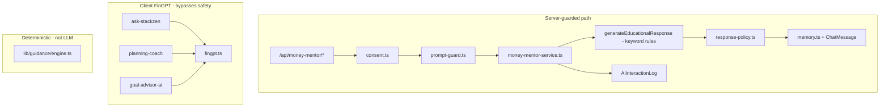

# StackZen AI System Audit

**Audit date:** 2026-05-16  
**Auditor role:** Senior AI systems / fintech AI architecture review  
**Scope:** Entire repository — providers, routes, safety, memory, compliance, duplication, security  
**Status:** Phase 1 complete — **no orchestration implementation in this phase**

---

## 1. Executive summary

StackZen’s **production AI safety layer (Phase 6)** is real and valuable: consent gates, prompt guards, response policy, optional encrypted chat memory, and append-only `AiInteractionLog`. However, the **generative AI surface is fragmented and mostly non-LLM**:

| Layer | Maturity | Notes |
|-------|----------|-------|
| Compliance-oriented server path (Money Mentor API) | **Medium** | Rule-based responses; guards work; no external model yet |
| Documented Zen Companion (PhraseCatcher, Tone Matrix, Memory Graph) | **Not implemented** | Docs/QA claim “complete”; zero runtime code |
| Multi-provider orchestration (OpenAI, Claude, Gemini) | **Not implemented** | Placeholders in UI; `lib/ai/providers/` does not exist |
| FinGPT integration | **Partial / high risk** | Single HTTP client; client-callable; contradicts safety preamble |
| Vector / RAG / embeddings | **Absent** | No semantic retrieval |
| Audit & logging | **Partial** | `AiInteractionLog` write-only; no admin query API |
| Operational guidance engine | **Strong (deterministic)** | Not LLM — forecast/goals-based |

**Critical finding:** Users can be exposed to **unguarded FinGPT** (system prompt: *“You are a financial expert AI.”*) while Money Mentor uses educational-only copy. This is a **compliance and hallucination risk** until all AI traffic routes through a single orchestration gateway.

---

## 2. Inventory — `lib/ai/` (current)

| File | Purpose | Production-ready? |
|------|---------|-------------------|
| `lib/ai/consent.ts` | `requireAiConsent`, `grantAiConsent`, `getAiPrivacySettings` | Yes |
| `lib/ai/prompt-guard.ts` | Injection, length, restricted-topic input blocks; `MONEY_MENTOR_SYSTEM_PREAMBLE` | Guards yes; preamble **unused** |
| `lib/ai/response-policy.ts` | Output regex blocklist + `softenDirectivePhrases` | Partial coverage |
| `lib/ai/money-mentor-service.ts` | Chat orchestration (rule-based `generateEducationalResponse`) | Safe but not “AI OS” |
| `lib/ai/memory.ts` | Memory gating, `logAiInteraction`, `clearAiMemory` | Yes |
| `lib/ai/chat-persistence.ts` | Prisma `ChatMessage` CRUD + optional encryption | Yes |
| `lib/ai/fingpt.ts` | OpenAI-compatible HTTP to FinGPT | **Needs deprecation or server wrap** |
| `lib/ai/__tests__/prompt-guard.test.ts` | Unit tests | Yes |
| `lib/ai/__tests__/response-policy.test.ts` | Unit tests | Yes |

**Missing (referenced in docs or UI, not in repo):**

- `lib/ai/providers/` (OpenAI, Claude, Gemini adapters)
- `lib/ai/router.ts`
- `lib/ai/zen.ts`, `lib/ai/phrasecatcher.ts`
- `docs/stackzen-ai-compliance-and-algorithm.md` (linked from `README.md`)

---

## 3. Provider integrations

### 3.1 OpenAI (GPT-5 / GPT-5.5)

| Item | Finding |
|------|---------|
| npm package | **Not installed** (`openai`, `@ai-sdk/openai` absent from `package.json`) |
| Code usage | **None** — `OPENAI_API_KEY` present in `.env` / `.env.local` / `.env.production` with **zero TypeScript consumers** |
| UI | `components/ask-stackzen/store.ts` — stub `"OpenAI integration coming soon!"` |
| Planned role (product) | Reasoning, structured outputs, tool routing, summarization, Zen system logic |

**Risk:** Dormant API keys in env files (rotation + remove or wire through orchestrator).

### 3.2 Anthropic (Claude)

| Item | Finding |
|------|---------|
| npm package | **Not installed** |
| Code usage | **None** |
| UI | Ask StackZen stub for Claude |
| Expense classification | `lib/financial-automation/classification.ts` — merchant keyword `anthropic` / `claude.ai` for **bookkeeping**, not chat |
| Planned role | Financial guidance tone, emotional intelligence, mentor-style coaching |

### 3.3 Google (Gemini 2.5 Pro)

| Item | Finding |
|------|---------|
| npm package | **Not installed** |
| Code usage | **None** |
| Planned role | Long document / file analysis, report summarization, fallback reasoning |

### 3.4 FinGPT (only live external integration)

| Item | Finding |
|------|---------|
| Module | `lib/ai/fingpt.ts` — `callFinGPT(prompt: string)` |
| Env | `FINGPT_API_URL`, `FINGPT_API_KEY` (defaults to placeholder URL/key) |
| System prompt | `'You are a financial expert AI.'` — **conflicts with** `MONEY_MENTOR_SYSTEM_PREAMBLE` |
| Call sites | `components/ask-stackzen/store.ts`, `components/planning-coach/index.tsx`, `components/goal-advisor-ai/index.tsx` |
| Server path | **Not used** by Money Mentor service |
| Safety | **No** consent, prompt guard, response policy, or `AiInteractionLog` |

**Risk:** If `fingpt.ts` is bundled for client components, API keys may be exposed unless calls move server-side only.

### 3.5 Perplexity

UI placeholder only in Ask StackZen — no implementation.

---

## 4. Zen AI architecture (documented vs actual)

### 4.1 Documented Zen Companion (MVP / launch docs)

Sources marking features **complete** (code does not exist):

- `docs/Build/StackZen Master Development Plan.md` — PhraseCatcher, Tone Matrix, Memory Graph, Reflection
- `docs/Build/StackZen_Final_MVP_Checklist_Reloaded.md`
- `docs/Business requirements/StackZen Launch Tracker Sheet.md`
- `docs/QA instructions/stackzen-mvp-qa-checklist-updated.md` — QA steps for PhraseCatcher / Tone Matrix
- `docs/Build/StackZen_CursorAI_BuildGuide.md` — references `lib/ai/zen.ts`, `lib/ai/phrasecatcher.ts`

| Feature | Documented behavior | Runtime status |
|---------|---------------------|----------------|
| **PhraseCatcher** | Intent triggers (“I need help”, “Can I afford…”) | **Not implemented** |
| **Tone Matrix** | Calm / Coach / Direct personalization | **Not implemented**; `UserOnboardingData.aiCommunicationStyle` **unused** in AI paths |
| **Zen Memory Graph** | Structured evolving memory | **Flat** `ChatMessage` list only; **not fed into generation** |
| **Reflection tracker** | Weekly AI summary | **Not implemented** |
| **Mood-aware guidance** | Tied to emotional state | `components/EmotionalState` — **local UI only**, not connected to Money Mentor |

### 4.2 Actual runtime architecture (today)



---

## 5. PhraseCatcher logic

| Aspect | Finding |
|--------|---------|
| Code | **Zero** matches in `lib/`, `app/`, `components/` (only in `docs/`) |
| Intended use (docs) | Map user phrases to intents (help, affordability, struggle) and route Zen responses |
| Gap | No intent registry, no confidence scoring, no integration with prompt guard or router |
| Related risk | `PlanningCoach` default prompts include affordability-style questions sent to **unguarded** FinGPT |

**Recommendation:** Implement PhraseCatcher as **deterministic pre-router** in `lib/ai/policies/` (not LLM-based) before any model call.

---

## 6. Tone Matrix logic

| Aspect | Finding |
|--------|---------|
| Code | **Zero** implementation |
| UX spec | `docs/UX-UI/stackzen_ux_ui_master_consolidated.md` — Calm / Coach / Direct |
| DB | `UserOnboardingData.aiCommunicationStyle` exists but **not read** by `handleMoneyMentorChat` |
| Tier flag | `lib/tier-validation.ts` — `zen-ai-insights` — **not enforced** on AI API routes |

**Recommendation:** Tone Matrix should map to **system prompt modifiers** per provider (Claude-primary for empathetic modes) stored in `lib/ai/prompts/tone-matrix.ts`, user-controlled via settings with consent.

---

## 7. API routes

### 7.1 AI / chat / consent

| Route | Methods | Handler | Notes |
|-------|---------|---------|-------|
| `/api/money-mentor/chat` | POST | `handleMoneyMentorChat` | Primary — Turnstile + `ai_chat` rate limit |
| `/api/money-mentor` | POST, GET | Duplicate chat + history | **Consolidate** |
| `/api/money-mentor/history` | GET | History | Role inferred via `index % 2` — **fragile** |
| `/api/money-mentor/clear` | POST | Clear memory | |
| `/api/ai/consent` | GET, POST | Consent | **No client UI wired** in `useMoneyMentor` |
| `/api/ai/memory` | DELETE | Clear memory | Duplicates clear route |
| `/api/ai-recommendations` | GET | Static JSON + policy | Mock data with `potentialReturn` % — presentation risk |

### 7.2 Missing / phantom routes

| Reference | Status |
|-----------|--------|
| `/api/ai/chat` | Referenced in `tests/performance/load-test.ts` — **not implemented** |
| `useFinancialMentorship` → `/book`, `/connect`, `/search` | **Mismatch** with `POST /api/financial-mentorship` only |

### 7.3 Human mentorship (not generative AI)

`/api/financial-mentorship`, `/api/mentors/*` — human mentors (Daily.co, Stripe). Separate from Zen LLM orchestration.

### 7.4 Guidance (deterministic)

No `/api/guidance`. Logic in `lib/guidance/engine.ts` — cash-flow, goals, bills. **Imperative copy** (“tighten limits”) — operational, not securities advice, but tone differs from AI policy.

### 7.5 Rate limiting & proxy

- `lib/security/proxy-policy.ts` — `AI_API_PREFIXES`, bucket `ai_chat`
- `lib/api/rate-limit-request.ts` — strict bucket for AI chat

---

## 8. UI components & wiring

| Component | Path | Backend | Wired to `app/` pages? |
|-----------|------|---------|------------------------|
| MoneyMentor | `components/MoneyMentor/` | Guarded APIs | **No production page import found** |
| AskStackZen | `components/ask-stackzen/` | Client FinGPT | **No** |
| PlanningCoach | `components/planning-coach/` | Client FinGPT | **No** |
| GoalAdvisorAI | `components/goal-advisor-ai/` | Client FinGPT | **No** |
| AICompanion | `components/ai-companion/` | Empty placeholder | Stories/tests only |
| AiPersonalization | `components/ai-personalization/` | History display | Redirect to `/settings/ai` — **page missing** |
| EmotionalState | `components/EmotionalState/` | Local mood state | Dashboard widget — **isolated** |
| AI Analysis | `app/(dashboard)/income/investments/ai-analysis/page.tsx` | Static recommendations API | **Yes** |

---

## 9. AI memory storage

### 9.1 Prisma models

| Model | Fields (relevant) | Issues |
|-------|-------------------|--------|
| `ChatMessage` | `userId`, `content`, `isContentEncrypted` | No `role`, `conversationId`, `model`, `provider` |
| `UserSettings` | `aiConsentAt`, `aiMemoryEnabled`, `aiOptOut` | Correct gating |
| `AiInteractionLog` | `action`, `severity`, `details` (Json) | No read API; no token/cost fields |

### 9.2 Memory behavior

- Persistence only when: consent + `aiMemoryEnabled` + not opted out (`lib/ai/memory.ts`).
- **History is not injected** into `generateEducationalResponse` — storage without contextual use.
- Clear paths: `DELETE /api/ai/memory` and `POST /api/money-mentor/clear` (duplicate).
- Encryption: opt-in via `ENCRYPT_CHAT_CONTENT=true` (`lib/security/chat-content.ts`).

### 9.3 Redis stub

`lib/cache/redis.ts` — `getAIContext` returns `{}` (stub). No real personalization cache.

---

## 10. AI logging & audit

| Stream | Storage | Written by | Gaps |
|--------|---------|------------|------|
| AI interactions | `AiInteractionLog` | `logAiInteraction` | No admin/user query API |
| Security audit | `AuditLog` | `writeAuditLog` | Only some AI events (e.g. memory clear) |
| Catalog | `lib/security/audit-catalog.ts` | Constants defined | Not all actions use `writeAuditLog` |

**Logged today:** `ai.prompt_blocked`, `ai.chat_completed`, `ai.response_policy_applied`, `ai.consent_granted`, `ai.recommendations_viewed`, `ai.memory_cleared`.

**Not logged:** FinGPT client calls, model ID, latency, token usage, fallback events, moderation decisions.

---

## 11. AI moderation

| Capability | Status |
|------------|--------|
| Input prompt guard | Yes — regex (`lib/ai/prompt-guard.ts`) |
| Output response policy | Yes — regex (`lib/ai/response-policy.ts`) |
| Third-party moderation API (OpenAI Moderation, etc.) | **No** |
| Human review queue | **No** |
| Abuse reporting on AI messages | **No** |

---

## 12. AI consent logic

| Control | Server | Client UI |
|---------|--------|-----------|
| `POST /api/ai/consent` | Yes | **Not called** from `hooks/useMoneyMentor.ts` |
| `aiOptOut` | Blocks APIs | No dedicated UI |
| `aiMemoryEnabled` | Settings PATCH (requires consent) | Not in `AiPersonalizationControls` |
| Turnstile on chat | Production gate on money-mentor POST | Depends on client passing token |

**Error codes:** `AI_CONSENT_REQUIRED`, `AI_OPT_OUT`, `PROMPT_INJECTION`, `RESTRICTED_TOPIC`, `TURNSTILE_FAILED` (see `docs/Security/PHASE_6_IMPLEMENTATION_LOG.md`).

---

## 13. Vector / search systems

| Technology | Present? |
|------------|----------|
| pgvector / Supabase Vector | **No** |
| Pinecone / Weaviate | **No** |
| Embeddings pipeline | **No** |
| RAG / document chunking | **No** |
| Semantic search over transactions | **No** |

Financial data retrieval today is **Prisma/SQL** only (dashboards, guidance engine, Plaid sync).

---

## 14. Environment variables

| Variable | In `.env.example` | Used in code | Notes |
|----------|-------------------|--------------|-------|
| `ENABLE_AI_FEATURES` | Yes | **No** | Should gate routes + UI |
| `FINGPT_API_URL` | No | Yes | Not in `lib/env.ts` Zod schema |
| `FINGPT_API_KEY` | No | Yes | Security: server-only required |
| `OPENAI_API_KEY` | No | **No** | Orphan in local env files |
| `ANTHROPIC_API_KEY` | No | **No** | — |
| `GOOGLE_GENERATIVE_AI_API_KEY` / `GEMINI_*` | No | **No** | — |
| `ENCRYPT_CHAT_CONTENT` | Yes | Yes | Default `false` in example |
| `NEXT_PUBLIC_*` AI keys | — | — | **Must never** expose provider keys |

**Gap:** `lib/env.ts` does not validate AI provider keys — orchestration layer should centralize validation.

---

## 15. Security risks

| Risk | Severity | Evidence |
|------|----------|----------|
| Unguarded FinGPT client paths | **Critical** | Bypass consent, policy, audit |
| FinGPT system prompt (“financial expert”) | **High** | Opposite of educational-only stance |
| Doc/compliance false completeness | **High** | PhraseCatcher/Tone Matrix marked done in launch docs |
| Missing compliance algorithm doc | **Medium** | README link broken |
| Dormant `OPENAI_API_KEY` in env | **Medium** | Secret sprawl |
| `callFinGPT` potentially client-bundled | **Critical** if key in client bundle | Move to server-only route |
| History role inference (`index % 2`) | **Medium** | Wrong pairing breaks UX/audit |
| Static recommendations with return % | **Medium** | SEC/MiFID presentation concern |
| No hallucination grounding | **High** when LLM enabled | No tool-verified balances in replies |
| Encryption off by default | **Medium** | Chat plaintext at rest |

---

## 16. Hallucination risk areas

| Area | Risk | Mitigation today | Needed |
|------|------|------------------|--------|
| Money Mentor (rule-based) | Low | Templates only | Wire LLM with tools + citations |
| FinGPT components | **High** | None | Route through orchestrator + policy |
| AI recommendations API | Medium | Static data + disclaimer | Remove implied performance or ground in real portfolio |
| Guidance engine | Low | Deterministic from DB | Keep separate from generative Zen |
| Future document analysis (Gemini) | High | N/A | Source grounding + chunk citations |
| Affordability questions | High | PhraseCatcher not blocking FinGPT path | Intent policy + structured “educational framing” |

---

## 17. Financial compliance risks

StackZen requirements (product):

- Never direct financial advice
- Never guarantee outcomes
- Never buy/sell/invest instructions
- Suggestion-based, emotionally safe, consent-aware, auditable

| Control | Coverage | Gaps |
|---------|----------|------|
| Input blocks | Partial regex | “Can I afford”, “should I sell”, tickers |
| Output blocks | Partial regex | “recommend buying”, allocations, tax mandates |
| System preamble | Defined, **unused** | Not sent to any LLM |
| Disclaimers | Money Mentor UI | Not on FinGPT UIs |
| Audit trail | Server path only | Client FinGPT invisible |
| Algorithm transparency doc | Missing | README reference broken |

---

## 18. Duplicated AI utilities

| Duplication | Locations | Action |
|-------------|-----------|--------|
| Chat POST | `/api/money-mentor` vs `/api/money-mentor/chat` | Single endpoint |
| Memory clear | `DELETE /api/ai/memory` vs `POST /api/money-mentor/clear` | Single endpoint |
| History GET | Two routes, different shapes | Standardize DTO |
| FinGPT call pattern | 3 components | Single server gateway |
| Mentorship hooks | `hooks/` vs `lib/hooks/` | Align with API |
| Unused Zod schema | `aiConsentPatchSchema` in `lib/validation/ai.ts` | Wire or remove |
| List messages | `listAiMemory` vs direct persistence calls | Single read API |

---

## 19. Related non-AI systems (context)

| System | Relation to AI |
|--------|----------------|
| `lib/guidance/engine.ts` | Deterministic “AI-like” notifications — keep out of LLM router |
| `lib/income-profiles/activation.ts` | `aiContextTags[]` → Money Mentor context |
| `lib/explainability/*` | Explicitly non-LLM operational explainability |
| Plaid / Stripe | Financial **data** for future tool-calling; not AI today |
| Spending guardrails (`app/api/guardrails`) | Budget limits — not content moderation |

---

## 20. Test coverage

| Area | Tests |
|------|-------|
| Prompt guard | `lib/ai/__tests__/prompt-guard.test.ts` |
| Response policy | `lib/ai/__tests__/response-policy.test.ts` |
| Money Mentor UI disclaimer | `components/MoneyMentor/MoneyMentor.test.tsx` |
| Consent API integration | **None** |
| Provider adapters / router | **None** |
| FinGPT paths | **None** |

---

## 21. Audit conclusions

### Strengths

1. Phase 6 safety primitives are a solid foundation for a regulated fintech AI surface.
2. Clear separation possible between **deterministic guidance** and **generative Zen**.
3. `MONEY_MENTOR_SYSTEM_PREAMBLE` aligns with non-directive educational stance (ready to use).
4. Consent + opt-out + memory flags model is appropriate for GDPR-style control.

### Blockers before production multi-model AI

1. **Single orchestration gateway** — no client-side provider calls.
2. **Implement or retract** documented Zen features (PhraseCatcher, Tone Matrix).
3. **Deprecate or wrap** `lib/ai/fingpt.ts` behind guarded server routes.
4. **Provider adapters** with fallback, logging, and unified `AIProvider` interface.
5. **Expand** policy coverage and add grounding/tool-use for financial figures.
6. **Wire consent UI** and enforce `ENABLE_AI_FEATURES`.
7. **Fix** documentation drift (README compliance doc, launch tracker checkboxes).

### Phase 2 readiness

**Ready to proceed** with orchestration implementation per `AI_ORCHESTRATION_PLAN.md` after stakeholder sign-off on this audit.

---

## 22. File index (quick reference)

```
lib/ai/
  consent.ts, prompt-guard.ts, response-policy.ts
  money-mentor-service.ts, memory.ts, chat-persistence.ts, fingpt.ts

app/api/
  money-mentor/, ai/consent, ai/memory, ai-recommendations

components/
  MoneyMentor/, ask-stackzen/, planning-coach/, goal-advisor-ai/
  ai-personalization/, EmotionalState/, ai-companion/

prisma/schema.prisma
  ChatMessage, AiInteractionLog, UserSettings (AI fields)

docs/Security/PHASE_6_IMPLEMENTATION_LOG.md
```

---

*End of audit. Implementation of `lib/ai/router.ts` and providers must not duplicate logic above — extend and centralize.*
