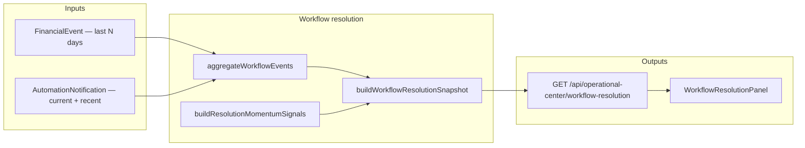

# Financial workflow resolution & habit reinforcement — architecture (Phase 2)

## Principles

- **No streaks. No badges. No “level up” copy.** Reinforcement is the visibility of **real follow-through** events from the canonical `FinancialEvent` ledger, scoped to the requesting user.
- **No new push notification.** Surfacing momentum as another `AutomationNotification` would create the very engagement spam we’re forbidden from building. The panel is **pull-only**.
- **No new Prisma model**, no new `FinancialEventType` enums; we reuse existing ones (`OPERATIONAL_FINANCIAL_ACTION_APPLIED`, `OPERATIONAL_ATTENTION_AUTO_RESOLVED`, `GOAL_CONTRIBUTION_RECORDED`, `GOAL_MILESTONE_REACHED`, `OPERATIONAL_ACTIVATION_MILESTONE`).
- **Single read model**, deterministic counts only. No `score` field beyond a count of distinct follow-through factors that fired.

## Components



## DTOs

```ts
interface AppliedActionAggregateDto {
  kind: 'PAUSE_AUTOMATION_RULE' | 'RECORD_GOAL_CONTRIBUTION' | 'EXTEND_GOAL_TARGET_DATE';
  count: number;
  /** Oldest forecast snapshot before any applied event in window (when available in metadata). */
  oldestForecastBeforeAt: string | null;
  /** Newest forecast snapshot after any applied event in window. */
  newestForecastAfterAt: string | null;
}

interface GoalContributionAggregateDto {
  count: number;
  totalUsd: number;
  goalsTouched: number;
  milestoneCount: number;
}

interface OpenAttentionStateDto {
  queueSize: number;
  oldestPendingProposalAgeDays: number | null;
}

interface WorkflowResolutionMomentumFactorDto {
  code:
    | 'CORRECTIVE_ACTIONS_APPLIED'
    | 'ATTENTION_AUTO_RESOLVED'
    | 'GOAL_CONTRIBUTIONS_LOGGED'
    | 'GOAL_MILESTONES_REACHED'
    | 'ACTIVATION_PROGRESS_RECORDED';
  summary: string;
  reasoning: string[];
}

interface WorkflowResolutionSnapshotDto {
  generatedAt: string;
  windowDays: number;
  /** Count of follow-through factors that fired in window — not a health score. */
  momentumFactorCount: number;
  factors: WorkflowResolutionMomentumFactorDto[];
  appliedActions: AppliedActionAggregateDto[];
  dismissedActionCount: number;
  recommendationsIssuedInWindow: number;
  attentionAutoResolvedInWindow: number;
  goalContributions: GoalContributionAggregateDto;
  activationMilestonesInWindow: number;
  openAttention: OpenAttentionStateDto;
  explain: {
    assumptions: string[];
    inputsUsed: Record<string, number | string | boolean>;
  };
}
```

## 1. Workflow follow-through tracking (deterministic)

For each lifecycle stage we already have a **canonical signal**:

| Stage | Source |
|-------|--------|
| Issued | `AutomationNotification.createdAt` where `attentionKind` starts with `operational_action_` and was created within `windowDays`. |
| Applied | `FinancialEvent` rows of type `OPERATIONAL_FINANCIAL_ACTION_APPLIED` in window; `metadata.kind` and `metadata.forecastBeforeAt/AfterAt` present. |
| Dismissed | `AutomationNotification` rows whose `metadata.dismissedAt` falls within window and `attentionKind` starts with `operational_action_`. |
| Auto-resolved | `FinancialEvent` of type `OPERATIONAL_ATTENTION_AUTO_RESOLVED` in window. |
| Goal contributions | `FinancialEvent.GOAL_CONTRIBUTION_RECORDED` (sum amounts; count distinct `relatedEntityId`). |
| Goal milestones | `FinancialEvent.GOAL_MILESTONE_REACHED`. |
| Activation milestones | `FinancialEvent.OPERATIONAL_ACTIVATION_MILESTONE`. |

## 2. Measurable financial improvement

For applied actions, we surface the **forecast before / after timestamps** stored in `metadata.forecastBeforeAt/AfterAt`. The actual numeric balance comparison is **already returned by `applyOperationalFinancialAction`** at apply time and is therefore live in audit history (the user has already seen it). The panel surfaces:

- **Per-kind apply counts** (so users see “3 goal contributions, 1 rule paused, 1 deadline extended this fortnight”).
- **Oldest before / newest after** timestamps so users can understand “forecasts that drove these decisions ranged from … to …”.

We do **not** invent a “reserve improved by X%” metric without history; absence of a snapshot table is honest, deterministic, and avoids fake metrics.

## 3. Operational momentum (count, not score)

`momentumFactorCount` = number of the five factor codes that fired with `count > 0` in window. This is **transparent**: 0–5 “types of follow-through visible.” Each factor lists which event type contributed.

## 4. Reinforcement systems

Reinforcement is purely **visibility of past audit-confirmed work**:

- “2 corrective actions applied in last 14 days · oldest forecast before 2026-04-30, newest after 2026-05-09.”
- “4 attention rows auto-resolved by deterministic engine.”
- “$320 contributed to 2 reserve goals; 1 milestone reached.”
- “Oldest pending operational action: 6 days — open the hub to apply or dismiss.”

If `momentumFactorCount === 0`, the panel says so honestly (“no follow-through events in last N days; nothing to celebrate yet”) — no fake encouragement.

## 5. Explainability

- `explain.assumptions` documents windowing, event types read, and ownership scope.
- `explain.inputsUsed` includes window length, raw event count, queue size, oldest pending age.
- Each factor `reasoning[]` lists the formula and the event type(s).

## 6. Operational workspace integration

- New panel **`WorkflowResolutionPanel`** rendered in `UnifiedOperationalWorkspace` after `ReserveAllocationIntelligencePanel`.
- Provides links back into `/operational-center` (operational actions hub), `/financial-timeline` (full audit), `/goals/operational`, and `/money-control?tab=review` for unresolved pending proposals.
- No automatic refresh nag; uses the existing `useOperationalAttentionRealtime` hook is **not** wired (panel reflects audit history; refreshes when user explicitly hits the workspace refresh).

## API

- `GET /api/operational-center/workflow-resolution?windowDays=14`
  - `windowDays` is parsed and clamped to `[1, 60]`.
  - Returns `WorkflowResolutionSnapshotDto`.
  - **No** `ensure` parameter, no notification writes — strictly read-only.

## What we explicitly do NOT do

- Do not add new `FinancialEventType` values.
- Do not push “you completed N actions!” notifications.
- Do not store streaks or “consecutive days.”
- Do not award points or badges.
- Do not infer “improvement” without ledger evidence.
- Do not bypass user approval for any mutation.
