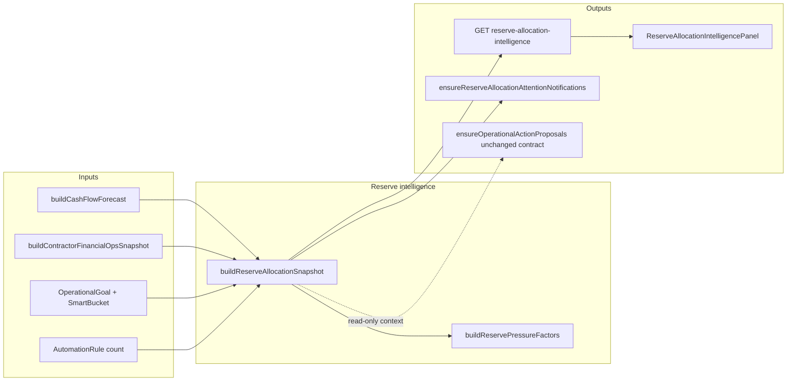

# Smart allocation & reserve automation — architecture (Phase 2)

## Principles (non-negotiable)

- **No autonomous money movement** and no hidden rule changes.
- **No abstract “financial health” score** — only explicit factor lists and a transparent **factor count** (score = number of active operational factors).
- **Deterministic + explainable:** every line traceable to `FinancialTransaction` / `SmartAllocation` / `SmartBucket` / `Job` / `Invoice` / `buildCashFlowForecast` / `OperationalGoal` inputs.
- **User approval:** mutations remain in **Operational financial actions** (`PAUSE_AUTOMATION_RULE`, `RECORD_GOAL_CONTRIBUTION`, `EXTEND_GOAL_TARGET_DATE`) and Money Control surfaces.

## Component overview



## 1. Dynamic reserve pressure

**Inputs**

- `CashFlowForecastResponseDto`: `risks[]`, `windows` (30d `lowestProjectedBalance`, `expectedAllocationImpactTotal`), `recurringIncome`, `explain.inputsUsed.weeklyAllocationEstimateUsd`.
- `ContractorFinancialOpsSnapshotDto`: material exposure, negative margin, receivable concentration, `reserveNudges`, `forecastRiskCodes` (aligned with same forecast when injected).
- Active `OperationalGoal` rows: progress = `min(smartBucket.currentAmount, targetAmount) / targetAmount` for reserve kinds.
- `AutomationRule` count: `enabled && type === ALLOCATION` (discretionary automation pressure exists).

**Factors (examples, each binary)**

- Critical / warning `PROJECTED_LOW_BALANCE`
- `ALLOCATION_PRESSURE`
- Timing stress: `BILLS_BEFORE_NEXT_INCOME`, `BILL_CLUSTER`, or `INVOICE_RECEIVABLE_GAP`
- `DEPOSIT_RUNWAY_WARNING`
- Contractor: material exposure, negative margin, receivable concentration breach
- Reserve under-fill: any active goal of kind `EMERGENCY_FUND`, `TAX_RESERVE`, `BUSINESS_RESERVE`, `RUNWAY` below 50% progress
- Income pattern instability: any detected income series with `cadence === 'unknown'` or `confidence < 0.5`

**Elevated attention:** upsert notification when **score ≥ 4** OR any **critical** low-balance risk.

## 2. Adaptive allocation guidance (read-only)

Structured **guidance rows** in the snapshot (not auto-applied):

- If `ALLOCATION_PRESSURE` → “Review allocation rules / envelopes in Money Control”; link `OPEN_MONEY_CONTROL` tab `rules`.
- If reserve under-fill + allocation pressure → “Prefer pausing or narrowing discretionary automation before slowing emergency/tax goals.”
- If contractor material exposure + personal low balance → “Align deposit collection with personal runway (Cash Flow + Jobs).”

These **mirror** operational action proposals where overlap exists; they do not replace `ensureOperationalActionProposals`.

## 3. Contractor reserve protection

Reuse **`buildContractorFinancialOpsSnapshot`** (with **shared forecast** optional param) so contractor nudges and material signals are not recomputed with a divergent forecast.

## 4. Safe action workflows

- **Preview / apply:** continue using `lib/operational-actions/preview.ts` + `apply.ts` + fingerprint staleness.
- **Dismiss / stale:** unchanged (`dismiss.ts`, `ensure-proposals.ts`).
- Reserve panel surfaces **links** to proposals in the attention queue (same hub), not a parallel apply API.

## 5. Explainability

Snapshot includes:

- `explain.assumptions` (short bullets referencing canonical engines)
- `explain.inputsUsed` (counts, weekly allocation string from forecast explain, score)
- Per-factor `reasoning: string[]`

Notifications include `metadata.trust` + `metadata.reserveAllocationIntel` payload: `{ score, factorCodes[], generatedAt }`.

## 6. Operational workspace integration

- New **`ReserveAllocationIntelligencePanel`** embedded in `UnifiedOperationalWorkspace` after contractor or near financial actions.
- Fetches `GET /api/operational-center/reserve-allocation-intelligence?ensure=true`.

## API

- `GET /api/operational-center/reserve-allocation-intelligence?ensure=true|false`  
  - Returns `ReserveAllocationSnapshotDto` JSON.  
  - When `ensure`, runs `ensureReserveAllocationAttentionNotifications(userId, snapshot)` to avoid double-building.

## Hub refresh (alerts route)

- `GET /api/operational-center/alerts?ensure=true` calls **`buildReserveAndContractorIntelligenceBundle`** once, then passes **`contractor`** into `ensureContractorOperationalAttentionNotifications` and **`reserve`** into `ensureReserveAllocationAttentionNotifications`, eliminating a duplicate forecast + contractor rebuild on the same refresh.

## Deduping & domain

- `attentionKind`: `reserve_alloc_ops_elevated_pressure`
- Dedupe key: `reserve_alloc_ops:elevated_pressure`
- UI domain: **`financial`** (money, rules, runway)

---

## V2 additions (continuation)

V2 extends the existing snapshot **without** introducing a new allocation engine, a second forecast, autonomous money movement, or schema changes. All additions remain deterministic and explicit.

### 1. SavingsRule visibility (read-only context)

- New snapshot field `savingsRulesContext: { enabledCount, totalCount, sample[] }`.
- Pulled in the same `Promise.all` as the existing allocation-rule reads — no new round trip beyond a single Prisma query.
- Surfaced in the panel so users see automation that the v1 sample omitted (`SavingsRule` lives in a separate table from `AutomationRule`).
- **Not** combined with `AutomationRule` into a single "allocation engine" count: the labels remain distinct.

### 2. Discretionary spend pressure factor (binary, gated)

- New helper `lib/reserve-allocation-intelligence/discretionary.ts` exports:
  - `DISCRETIONARY_CATEGORY_PATTERNS` — explicit lowercase substring list (dining, restaurants, coffee, bars, alcohol, entertainment, streaming, games, shopping, clothing, beauty, hobbies, travel, recreation, subscriptions).
  - `computeDiscretionaryOutflowStats(rows)` — pure function over a trailing 30-day window of `FinancialTransaction` rows (`direction === OUTFLOW`, `isTransfer === false`).
- Factor `DISCRETIONARY_SPEND_PRESSURE` is added **only when both**:
  - `discretionaryShare >= 0.40` over the window, **and**
  - any of `ALLOCATION_PRESSURE`, `PROJECTED_LOW_BALANCE_WARNING`, `PROJECTED_LOW_BALANCE_CRITICAL`, or `CASH_TIMING_OR_RECEIVABLE_STRESS` is already present.
- This guarantees the factor does not create a stand-alone alarm; it only sharpens existing pressure with a reviewable, deterministic explanation (top 3 category names by trailing total).

### 3. Top under-filled reserve goals (deterministic deep-link source)

- New helper `selectTopUnderfilledReserveGoals(goals, limit = 3)` returns the lowest-progress `OperationalGoal` rows in `{EMERGENCY_FUND, TAX_RESERVE, BUSINESS_RESERVE, RUNWAY}` that are `ACTIVE`, `target > 0`, and `progress < 0.5`.
- Surfaced on the snapshot as `topUnderfilledReserveGoals[]` (`goalId`, `name`, `goalKind`, `targetAmount`, `currentAmount`, `progress`).
- Same dataset already loaded for `RESERVE_GOALS_UNDER_HALF` factor — no duplicate query.

### 4. Goal-specific deep-link actions

- `ensureReserveAllocationAttentionNotifications` builds `OPEN_OPERATIONAL_GOAL { goalId }` actions for up to the top **2** under-filled reserve goals before appending `OPEN_CASH_FLOW`, `OPEN_MONEY_CONTROL`, and a single `CREATE_GOAL` fallback (only when no goals are under-filled).
- Existing dedupe key (`reserve_alloc_ops:elevated_pressure`) is unchanged; UI domain stays `financial`.

### 5. Snapshot DTO change set

```ts
type ReserveAllocationSnapshotDto = {
  // …v1 fields unchanged…
  discretionaryOutflowStats: {
    lookbackDays: 30;
    sampleSize: number;          // OUTFLOW + non-transfer rows in window
    totalOutflowUsd: number;     // sum |amount|
    discretionaryOutflowUsd: number;
    discretionaryShare: number;  // 0..1
    topDiscretionaryCategories: { name: string; usd: number }[]; // ≤ 3
  };
  topUnderfilledReserveGoals: {
    goalId: string;
    name: string;
    goalKind: OperationalGoalKind;
    targetAmount: number;
    currentAmount: number;
    progress: number;
  }[];
  savingsRulesContext: {
    enabledCount: number;
    totalCount: number;
    sample: { id: string; name: string; type: string }[]; // ≤ 6 enabled
  };
};
```

### 6. Determinism and audit notes

- **No schema migrations.** All new data derives from existing Prisma models.
- **No new write paths.** The notification path is unchanged; only the `actions[]` array is expanded with goal-scoped deep links sourced from the same Prisma rows used by the factor.
- **Explainability:** `explain.assumptions` gains entries describing the discretionary share rule and the top-underfilled selection rule; `explain.inputsUsed` gains `discretionaryLookbackDays`, `discretionarySampleSize`, `enabledSavingsRuleCount`.
- **Threshold rationale (auditable):**
  - 30-day window — matches existing 30d forecast window.
  - 40% discretionary share — same magnitude as the existing reserve-goal under-fill threshold (50%) but biased lower because discretionary categorization is intentionally inclusive.
  - Top 2 goal actions — fits the existing actions panel without crowding `OPEN_CASH_FLOW` / `OPEN_MONEY_CONTROL` links.
