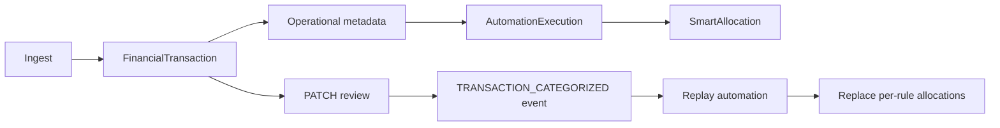

# Transaction Review & Automation Control — Phase 2 Architecture

Operational UX design for **`FinancialTransaction`**-centric review, **`AutomationRule`** control, **`AutomationNotification`** resolution, **`SmartBucket`/`SmartAllocation`** visibility, and **`FinancialEvent`**-backed activity — without duplicating engines.

---

## UX flows (happy path)

### A. Transaction Review Center (`/money-control`, tab **Review**)
1. User sees **canonical ledger** (`GET /api/automation/transactions`).
2. Select row → **detail panel** loads `GET /api/automation/transactions/:id` → `{ transaction, allocations[], executions[], explanation }`.
3. User **corrects** category / operational class / business–personal / recurring flag → `PATCH /api/automation/transactions/:id` → timeline gets `TRANSACTION_CATEGORIZED`; automation replay updates buckets idempotently.
4. User navigates **Review transaction** from an alert (`?highlight=` id) deep-link.

### B. Automation Control Center (tab **Rules**)
1. `GET /api/automation/rules` — ordered list (`priority`).
2. **Pause / resume**: `PATCH /api/automation/rules/:id` `{ enabled }` — same free-tier “one active rule” validation as POST.
3. **Reorder** (premium-friendly): `PATCH` `{ priority }` — numeric sort ascending.
4. **Execution history**: `GET /api/automation/executions?ruleId=&limit=` — table of status, timestamps, snapshots (collapse JSON in UI).

### C. Notifications (tab **Alerts**)
1. `GET /api/automation/notifications`.
2. **Mark read**: `PATCH /api/automation/notifications/:id` `{ readAt: true }`.
3. **Snooze**: `PATCH` `{ snoozeHours: number }` — stores `snoozedUntil` in `metadata`; client hides row until expiry (honor in GET filter optionally — MVP client-side hide).
4. Primary buttons map `metadata.actions` → router push `/money-control?tab=review&txn=` etc.

### D. Bucket visibility (tab **Buckets**)
1. `GET /api/automation/smart-buckets` — `SmartBucket` + recent `SmartAllocation` lines (include `financialTransactionId` for drill-down).
2. Row action **View transaction** → Review tab + selected id.

### E. Activity / trust (tab **Activity**)
1. `GET /api/financial-events/timeline?types=TRANSACTION_CREATED,TRANSACTION_CATEGORIZED,AUTOMATION_RULE_EXECUTED,AUTOMATION_RULE_FAILED,AUTOMATION_NOTIFICATION_CREATED,GUARDRAIL_WARNING,GUARDRAIL_BREACH&limit=50`
2. Optional **Expand** JSON metadata in disclosure for power users.

---

## Transaction review lifecycle

---

## Automation control lifecycle

- **Visibility**: rules list + executions query (read-only snapshots).
- **Control**: enable/disable + priority (writes to `AutomationRule`).
- **Correction**: transaction PATCH + optional future “revert allocation” tooling (reuse idempotent replace).
- **Explanation**: deterministic copy + `resultSnapshot` / `AUTOMATION_RULE_EXECUTED` event metadata (`allocationPersisted`, etc.) — no synthetic LLM text required for MVP.

---

## Notification action architecture

- Parse `AutomationNotification.metadata` as `{ version: 1, actions: AutomationClientAction[] }`.
- Map `type` → in-app handlers (Next.js router):
  - `REVIEW_TRANSACTION` → `/money-control?tab=review&txnId=`
  - `EDIT_ALLOCATION_RULE` → `/money-control?tab=rules&ruleId=` (scroll/highlight via query)
  - `ADJUST_CATEGORY` → open review detail for `financialTransactionId`
  - Others: toast “Open from Review tab” until dedicated modals exist.

---

## Bucket visibility strategy

- Show **running balance** from `SmartBucket.currentAmount`.
- Allocation lines show **amount**, **source** (`AUTOMATION_RULE:cuid`), **financialTransactionId** link.
- Clearly label **AUTOMATION_ENVELOPE** buckets vs user-created buckets (same table; differentiated by `type`).

---

## Anti-duplication strategy

- Single page hub; link to `/financial-timeline` for advanced filters, do not rebuild timeline engine.
- Do not consume `Income`/`Expense` merge table for automation trust UX.
- Do not introduce a second notifications table reader in this hub (`AutomationNotification` only).

---

## Premium gating strategy

- Rule **reorder** / **multiple concurrent enabled rules**: treat as premium (UI disables priority drag for FREE; PATCH returns 403 if second rule enabled — server already enforced on POST).
- **Custom allocation edit** UI: gated; **pause/reorder presets** aligned with POST rules.

---

## Fintech trust UX strategy

- Every automation row displays **rule name**, **type**, **last status**, **timestamp**.
- Allocation lines show **calculated dollar** amounts matching `resultSnapshot.allocations` when present.
- Empty states explain **bank sync**, **manual import**, **expenses** ingestion — no fake demo data.

---

## Scalability

- Pagination on transactions (extend `take`/`cursor` later); executions capped (e.g. 50/query).
- Timeline tab uses existing cursor API.

---

_Phase 2 complete._
