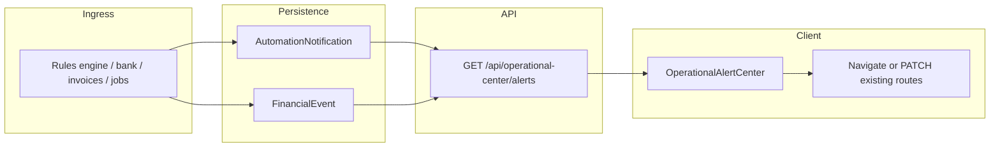

# Unified Operational Notification Center — Architecture (Phase 2)

## Product definition

Single **Operational Alert Center**: an attention queue for money and work—not a passive feed. Every surfaced item MUST support at least one **operational continuation** (navigate-and-fix, PATCH state, or open an existing correction flow).

Canonical persistence remains:

- **`AutomationNotification`** — in-app actionable queue (read, snooze, dismiss metadata, related entity linkage).
- **`FinancialEvent`** — explanation, audit trail, correlation by `relatedEntityType` / `relatedEntityId`.
- **`FinancialTransaction`** — canonical ledger for money remediation.

Fake AI payloads are forbidden; reserve extension points instead.

---

## Notification lifecycle

1. **Originate:** Domain logic (rules engine, bank sync helpers, invoice/job flows, operational `ensure*` passes) detects a condition worth human attention.
2. **Persist (optional dedupe):** Idempotent write to **`AutomationNotification`** with typed `severity`, stable `attentionKind` in `metadata` when duplicates would otherwise collide.
3. **Correlate:** On creation (already implemented in `createAutomationNotification`), emit **`AUTOMATION_NOTIFICATION_CREATED`** `FinancialEvent` when appropriate—keeping events as the centralized narrative.
4. **Present:** Client loads normalized DTOs from **`GET /api/operational-center/alerts`** (runs `ensure` + listing + enrichment).
5. **Act:** Primary actions routed client-side via typed `AutomationClientAction` extensions (`OPEN_*`, ledger review deeplinks, rule edit targets). Stateful actions reuse **`PATCH /api/automation/notifications/[id]`** (`markRead`, `snoozeHours`, `dismiss`).
6. **Resolve (UX tier):** `priority: resolved` when `readAt` is set **or** `metadata.dismissedAt` is present (informational/snoozed items are suppressed from the default operational queue).

Snooze/dismiss semantics stay in JSON metadata to avoid schema churn until a hardened snooze column is warranted.

---

## Action execution flow



- **Navigate:** Invoice, job, client, ledger review, buckets tab—no duplicated domain writes.
- **Mutate:** Only through existing PATCH APIs that enforce **userId** membership.

---

## Alert prioritization

| UI tier | Mapping |
|---------|---------|
| **critical** | `NotificationSeverity.CRITICAL` and/or money-at-risk interpretations (invoice overdue, guardrail breach) |
| **warning** | `NotificationSeverity.WARNING` |
| **informational** | `NotificationSeverity.INFO` |
| **resolved** | `readAt !== null` **or** `metadata.dismissedAt` set |

Client default view hides **snoozed** (`snoozedUntil` in future).

---

## Metadata standards (`AutomationNotification.metadata`)

Mandatory shape for operational items (additive to existing `{ version: 1, actions: [...] }`):

```json
{
  "version": 1,
  "attentionKind": "invoice_overdue | invoice_due_soon | job_payment | job_deposit | ...",
  "actions": [...],
  "trust": {
    "why": "Human-readable trigger reason.",
    "whatChanged": "Optional delta narrative.",
    "recommendedNextStep": "Single primary corrective action.",
    "sourceEventType": "Optional FinancialEventType string for provenance"
  }
}
```

Future AI attaches **confidence + modelId + citations** ONLY under `metadata.ai` once real inference exists.

---

## FinancialEvent integration

- **Reads:** Operational API batches recent `FinancialEvent` rows keyed by `"${relatedEntityType}:${relatedEntityId}"` (latest wins) for trust copy fallback.
- **Writes:** Preserve existing callers (`createFinancialEventSafe`); do not emit duplicate events purely for UI.
- Money Control **Activity** tab remains a chronological lens; Operational Center prioritizes actionable queue.

---

## Anti-duplication strategy

1. **Never** resurrect a phantom `Notification` Prisma model for the same UX.
2. **Invoice/job operational items** reuse `AUTOMATION_ACTION` (+ `attentionKind`) with idempotent lookups—no synthetic duplicate rows per poll beyond the guarded create.
3. **Guardrail / overspend:** continue `OVERSPENDING_ALERT`; do not fork a parallel alert table.

---

## Fintech trust UX strategy

Surfaced copy order per card:

1. **Impact** (`title`): what needs attention today.
2. **Numbers** (`body`): balances, percentages, invoice totals, dates.
3. **Why** (`trust.why`): transparent rule/account context (no black-box wording).
4. **Next step** (`trust.recommendedNextStep`) + labeled primary button(s).

Optional “View activity” drills into **`/financial-timeline`** filtered by correlation when needed (future query param tightening).

---

## Scalability assessment

| Concern | Mitigation |
|---------|------------|
| **ensure on GET** | Idempotent keyed creates; capped scans (`take: 25` per class); cheap existence checks via `attentionKind`. |
| **Event join N+1** | Single bounded `financialEvent.findMany` + in-memory grouping. |
| **Payload size** | Default `take: 120` alerts; paging can extend with `cursor` later. |

---

## Operational Center vs Money Control

- **Operational Center** (`/operational-center`): prioritized, grouped actionable queue + trust fields + primary navigation.
- **Money Control**: ledger truth + automation rules + optionally embed same alert renderer to avoid divergence.

Avoid adding a standalone “notifications” page—redirect legacy entry points here.
